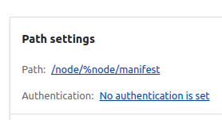

# Mirador viewer integration for Islandora

[](https://php.net/)
[](https://github.com/Islandora/islandora/actions)
[](./CONTRIBUTING.md)
[](./LICENSE)
[](https://codecov.io/gh/Islandora/islandora)

## Introduction

This is a Drupal module that wraps around the Mirador image viewer.
It does not strictly require Islandora, however it depends on an [IIIF Manifest](https://iiif.io/api/presentation/2.0/),
Islandora generates these manifests but they can also come from
third-party sources.

## Installation

```bash
$ composer require islandora/islandora_mirador
$ drush en islandora_mirador
```

### Upgrading from Islandora Defaults

This module was formerly distributed with Islandora Defaults. If you are upgrading
you may need to clear Drupal's cache and re-start your web server to resolve
a Plugin Not Found error.

### Mirador library

The module can use either an instance of Mirador Integration hosted
on the web, or deployed locally.

The UPEI Robertson Library maintains a version of the Mirador library that includes image manipulation and text overlay plugins. This compiled library is available on the web at https://roblib.github.io/mirador-integration-islandora/islandora-mirador-0.1.0.js, and the github project is at https://github.com/roblib/mirador-integration-islandora.

If you have a local build, put it in
your webroot at libraries/mirador/dist/main.js.

## Usage

This module provides a Block that can be included via Structure>Blocks or Contexts. It takes a IIIF manifest.

The module also provides a "Mirador" term in the `islandora_display` vocabulary that can be selected as a display hint when editing an Islandora Repository Item object. This can be used to trigger the above block placement.

See the documentation for [Islandora IIIF](https://islandora.github.io/documentation/user-documentation/iiif/) for how to set up the content that powers the viewer.


## Configuration

The Islandora Mirador configuration page is located at "Administration » Configuration » Media » Mirador Settings" (`/admin/config/media/mirador`).

- **Mirador library location:** You can select if the library is deployed locally or set the remote
library's location (see [Mirador library](#mirador-library) above).

- **Enabled Plugins:** You can also enable particular plugins. You need to know if the
plugins are included in the particular build of Mirador Integration. The Robertson Library version of Mirador supports both the "Text Overlay" and "Mirador Image Tools" plugins.

- **IIIF Manifest URL:** You can set the URL pattern to retrieve the IIIF manifest for a piece of content. Default Islandora comes with a REST export view titled "IIIF Manifest", found at `/admin/structure/views/view/iiif_manifest`. The URL to provide can be found in the single page display's path settings.<br />
<br />
Replace `%node` with `[node:nid]`, and prepend with the domain of your installation:<br />

## Plugins

### Default Plugins

As of version >= 2.3 the default Islandora Mirador configuration utilizes UPEI's version of the Mirador library, which is compiled with these Mirador 3 plugins:

- [Image Tools](https://github.com/ProjectMirador/mirador-image-tools)

    Toolbar providing extra image manipulation features like invert colors.

- [Text Overlay](https://github.com/dbmdz/mirador-textoverlay)

    Overlays embedded text such as hOCR on to the UI for text selection and screen reader support.

### Developing Custom Plugins

In Mirador 3 plugins must be built in to the application. See the documentation page [Creating Mirador 3 Plugins](https://github.com/ProjectMirador/mirador/wiki/M3---Creating-a-Mirador-plugin) for more information.

Follow the [Mirador library](#mirador-library) instructions above for deploying your custom-built Mirador app above to make it available to your Islandora site.

You can add support for other Mirador plugins in Islandora itself by implementing the plugin type
defined in this module. To do so, declare a subclass of Drupal\islandora_mirador\IslandoraMiradorPluginPluginBase
and add the following annotation:

```php
/**
 * @IslandoraMiradorPlugin(
 *   id = "machineName",
 *   label = @Translation("Plugin label"),
 *   description = @Translation("Description of the plugin .")
 * )
 */

```

The only function so far is windowConfigAlter. You can use it to supply
any configuration the plugin requires. Modifying the configuration
in the UI is not implemented yet.

## Using Text Overlay

When Mirador text overlay is configured properly, users can view, select, and use screen readers to read
text that has been OCR'd in scanned documents. With further work (yet to be implemented in the islandora_iiif module), the Mirador
viewer will be able to highlight text found via a search, and display a search interface to search
within the viewer.

### Setting up hOCR
To display a text overlay, Mirador must be provided with hOCR text data - which is OCR'd text that includes position information for the extracted text relative to the image that is being displayed. Here are the steps:
1. Go to "Administration » Structure » Media Types", select the "**File**" media type, and click "**Manage Fields**".
2. Add a new field to the **File** media type called "**hOCR extracted Text**". Set the allowed file extensions to "xml"<br />  
3. Go to "Administration » Configuration » System » Actions" and click "**Create New Advanced Action**" with the "**Generate Extracted Text for Media Attachment**" action type.<br /><br />
<br />
    - Give the new action a name that mentions hOCR.<br />
    - In Format field select hOCR Extracted Text with Positional Data
    - For Destination File Field Name select the field you just created (`field_hocr_extracted_text`)
    - Keep *None* for the destination text field
    - And save the action
4. Go to " Administration » Structure » Context" and edit the **Page Derivatives** context<br />
    - Click **Add Reaction** and choose "**Derive File for Existing Media**"
    - In the select box choose the action you created above and save.

### Test hOCR
Follow these steps to confirm that hOCR is working.
1. Add a new Repository Item with type **Paged Content**
2. Add a child object of type **Page**
3. On that child object, add a Media of type **File** and populate it with a TIFF file that has text on it (at this time, only TIFF files can be used for hOCR in the [ISLE-DC](https://github.com/Islandora-Devops/ISLE-DC) environment, see this issue on GitHub for details: [Tesseract in Hypercube does not support JP2](https://github.com/Islandora-Devops/isle-dc/issues/298))
    - Check **Original File** under "**Media Use**" (do NOT check any other media usages)
    - Do not add anything to the hOCR Extracted Text field you created. This will be populated when OCR is run on this file.
4. Save the media.
5. After about a minute, the extracted text with positional data field should be populated. You can verify this directly by editing the File object and seeing that the "hOCR extracted Text" field now has a file attached to it, and you can view the file and observe that it contains xml text that looks something like this:<br />


### Configuring the IIIF Manifest view for the Manifest additions
Assuming hOCR is [set up](#setting-up-hocr) and [tested](#test-hocr)...

We will show how to set up IIIF manifests to include text overlay in Mirador for single pages, and for paged content.

1. Go to "Administration » Structure » Views" and edit the **IIIF Manifest** view. This is included in the Islandora Starter Site.
2. There should be two displays, one for single-page nodes, and one for paged content. They are distinguished by their Contextual filters, found under the "Advanced" tab. In both cases, they have relationships for "field_media_of: Content" (required), and "field_media_use: Taxonomy term" (not required)<br />.<br /> However, they differ in their contextual filters:
    - The single-page contextual filter uses the current Media entity's "Media of" value, matching it with the "Content ID from the URL". The effect of this is to select all Media objects that are attached to the node identified by the current url.<br />
    - The paged-content contextual filter uses the "Content: Member of" relationship to find Media objects that are attached to children of the current node, identified by "Content ID from URL".<br/>
3. The two displays also differ in their path, under "Path Settings". For the single page manifest display, it would normally be `/node/[%node]/manifest` (matching what was configured on the [islandora mirador configuration page](#configuration)), whereas for the paged-content manifest display, it would normally be `/node/[%node]/book-manifest`.

The rest of the settings for the two displays are identical, as follows...<br />

1. In the left column, under "Fields", add "hOCR Extracted Text".
2. In the left column, under "Format", the Style plugin "IIIF Manifest" should be selected. Click "Settings". You will see two sets of checkboxes - "Tile source field(s)" and "Structured OCR data file field". Under "Structured OCR data file field", check "Media: hOCR extracted Text".<br />
3. In the "Filter criteria" section of the form, ensure that the "field_media_use: Taxonomy Term" filter is set to filter on the OriginalFile media term (not ServiceFile).
4. Save the view.

To test...
1. Go to the Page node you created in [test ocr](#test-hocr) and add "/manifest" to the end of the URL, or whatever you configured in the single page manifest view display.
2. Look for a seeAlso section in the XML that should contain a reference to the hOCR field with appropriate MIME Type and Description.
3. Repeat for the paged content node, substituting "/book-manifest" to the end of the url, or whatever you configured for the paged content manifest view display.


### Configuring the Mirador viewer to display for Pages and Paged Content using Contexts

Islandora uses contexts to control which blocks are displayed on different Islandora nodes. _Note that the following instructions are just one of many possible ways to configure this._

If not already present, you will need to add Mirador display contexts for single page and paged content types:<br />

Configure contexts at "Administration » Structure » Context".

- For single page ("Mirador") context, you can condition on the "Node has term" "Mirador" (if you like, AND "Page"), and set the reaction to Blocks. Use a View such as Media Display (part of Islandora Starter Site) to provide a block that displays the appropriate media using the "Mirador" view mode:<br /><br /><br />

- For multi-page ("Paged Content - Mirador") context, we condition on the "Node has term" "Mirador" AND "Paged Content"<br /><br />...and set the reaction to show the Mirador block in the content region <br /><br />... which is configured using `.../book-manifest` for the IIIF Manifest URL<br />

As noted previously, this is just one way to set up the Mirador viewer configurations. If, for example, you wanted to always use the Mirador viewer for pages and paged content, you could remove the "Mirador" condition from the "Node has term" condition in these contexts.


## Documentation

Further documentation for IIIF (International Image Interoperability Framework) is available on the [Islandora 8 documentation site](https://islandora.github.io/documentation/user-documentation/iiif/).

## Troubleshooting/Issues

Having problems? Solved a problem? Join the Islandora [communication channels](https://www.islandora.ca/community#channels-of-communication) to post questions and share solutions:

* [Islandora Mailing List (Google Group)](https://groups.google.com/g/islandora)


* If you would like to contribute or have questions, please get involved by attending our weekly [Tech Call](https://github.com/Islandora/islandora-community/wiki/Weekly-Open-Tech-Call), held virtually via Zoom **every Wednesday** at [**1:00pm Eastern Time US**](https://dateful.com/convert/est-edt-eastern-time?t=13). Anyone is welcome to join and ask questions! The Zoom link can be found in the meeting minutes [here](https://github.com/Islandora/islandora-community/wiki/Weekly-Open-Tech-Call).

If you would like to contribute code to the project, you need to be covered by an Islandora Foundation [Contributor License Agreement](https://github.com/Islandora/islandora-community/wiki/Onboarding-Checklist#contributor-license-agreements) or [Corporate Contributor License Agreement](https://github.com/Islandora/islandora-community/wiki/Onboarding-Checklist#contributor-license-agreements). Please see the [Contributor License Agreements](https://github.com/Islandora/islandora-community/wiki/Contributor-License-Agreements) page on the islandora-community wiki for more information.
## License

[GPLv2](http://www.gnu.org/licenses/gpl-2.0.txt)
